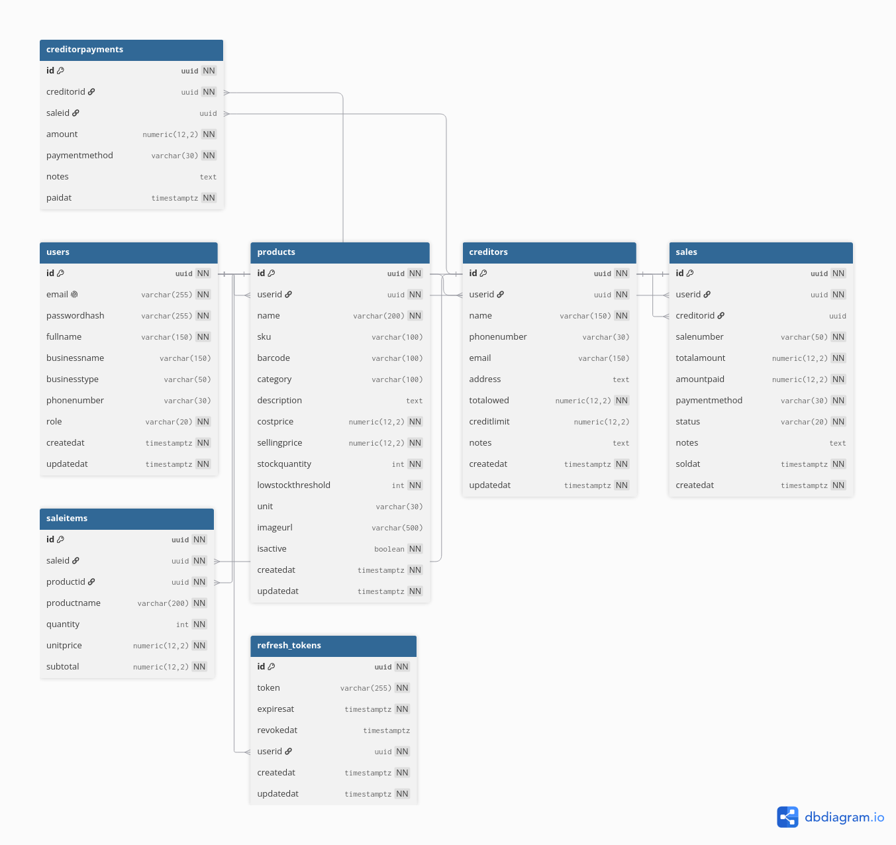

# SmartStock Backend

SmartStock Backend is a .NET 9 ASP.NET Core API for managing a small business inventory and sales workflow. It supports product management, sales processing, creditor tracking, reports, and authentication for users operating within a user-scoped business context.

This project is structured around Clean Architecture principles with clear separation between API, application logic, domain entities, and infrastructure persistence.

## Overview

SmartStock helps businesses manage:

- product catalog and stock levels
- sales and refunds
- creditor balances and payments
- dashboard and summary reporting
- user authentication and session management

## Key Features

- JWT authentication and refresh token support
- Product CRUD and stock adjustments
- Sale creation with validation and transaction safety
- Refund processing with stock restoration logic
- Creditor management and payment tracking
- Summary and dashboard report queries
- Validation using FluentValidation
- Centralized application error handling
- PostgreSQL persistence via Entity Framework Core
- Automated business-rule tests with xUnit

## Architecture

The solution is organized into the following layers:

- SmartStock.Api
  - ASP.NET Core API layer
  - controllers, startup configuration, Swagger, middleware
- SmartStock.Application
  - use cases, commands, queries, validation, DTOs
  - MediatR handlers
  - application exception model
- SmartStock.Domain
  - entities and domain contracts
  - business model definitions
- SmartStock.Infrastructure
  - EF Core DbContext and repository implementations
  - PostgreSQL integration and token service
- SmartStock.Tests
  - unit/integration-style regression tests for business rules

This is a user-scoped backend rather than a strict multi-tenant SaaS system. The application is designed around individual business users and their associated records.

## Tech Stack

- .NET 9
- ASP.NET Core Web API
- Entity Framework Core
- PostgreSQL (Npgsql)
- MediatR
- FluentValidation
- JWT Bearer authentication
- xUnit

## Project Structure

```text
SmartStockBackend/
├── docs/
│   └── database-diagram.svg
├── SmartStock.Api/
│   ├── Controllers/
│   ├── Middleware/
│   ├── appsettings.json
│   ├── appsettings.Development.json
│   └── Program.cs
├── SmartStock.Application/
│   ├── Common/
│   ├── Dtos/
│   ├── Features/
│   ├── Validators/
│   ├── DependencyInjection.cs
│   └── SmartStock.Application.csproj
├── SmartStock.Domain/
│   ├── Common/
│   ├── Entities/
│   ├── Repositories/
│   └── SmartStock.Domain.csproj
├── SmartStock.Infrastructure/
│   ├── Data/
│   ├── Repositories/
│   ├── Services/
│   ├── DependencyInjection.cs
│   └── SmartStock.Infrastructure.csproj
├── SmartStock.Tests/
│   ├── BusinessRulesTests.cs
│   └── SmartStock.Tests.csproj
├── SmartStockBackend.sln
├── .gitignore
├── README.md
└── docs/
    └── database-diagram.svg
```

## Database Diagram

The database schema for the application is documented here:



This diagram shows the main entities and relationships for users, products, sales, sale items, creditors, creditor payments, and refresh tokens.

## Prerequisites

Before running the project, make sure you have:

- .NET 9 SDK installed
- PostgreSQL database running locally or remotely
- Access to a configured database instance

## Configuration

The API reads configuration from:

- SmartStock.Api/appsettings.json
- SmartStock.Api/appsettings.Development.json

Update the connection string and JWT settings before running locally:

```json
{
  "ConnectionStrings": {
    "DefaultConnection": "Host=localhost;Port=5432;Database=smartstockdb;Username=postgres;Password=postgres;"
  },
  "Jwt": {
    "Secret": "YOUR_SUPER_SECRET_KEY_CHANGE_ME_TO_SOMETHING_VERY_SECURE_AND_LONG",
    "Issuer": "SmartStockBackend",
    "Audience": "SmartStockFrontend",
    "AccessTokenMinutes": 30,
    "RefreshTokenDays": 7
  }
}
```

For production, use environment variables or secret storage instead of committing real credentials to source control.

## Running the Project

### Restore dependencies

```bash
dotnet restore
```

### Build the solution

```bash
dotnet build SmartStockBackend.sln --nologo
```

### Run the API

```bash
dotnet run --project SmartStock.Api
```

By default, the API is available via the local ASP.NET Core host and Swagger UI in development mode.

## Swagger

When running in development, Swagger is enabled automatically. You can access it in the browser at:

```text
https://localhost:<port>/swagger
```

## API Modules

### Authentication

- Register user
- Login
- Refresh token
- Logout
- Get current user session

### Products

- list products
- view product by ID
- view product by barcode
- create product
- update product
- adjust stock
- delete product

### Sales

- list sales
- get sale by ID
- create sale
- refund sale

### Creditors

- list creditors
- get creditor details
- create creditor
- update creditor
- delete creditor
- list creditor payments
- create payment

### Reports

- dashboard overview
- sales summary
- top products
- inventory value

## Error Handling

The application follows a consistent error pattern:

- validation errors return a structured error response
- not-found scenarios return a not found response
- authorization issues return unauthorized responses
- business-rule violations are thrown as application exceptions and mapped by the API layer

Example response shape:

```json
{
  "error": {
    "code": "VALIDATION_ERROR",
    "message": "Stock quantity cannot be negative."
  }
}
```

## Testing

Run the test suite with:

```bash
dotnet test SmartStock.Tests/SmartStock.Tests.csproj --nologo
```

Current tests cover critical behavior such as:

- empty sale validation
- negative stock adjustment validation
- sale refund validation
- creditor payment validation
- controller error mapping consistency

## Notes for Portfolio / GitHub Use

This project demonstrates:

- Clean Architecture layering
- ASP.NET Core API design
- EF Core + PostgreSQL persistence
- Application-layer validation and business rules
- JWT-based authentication
- Transaction-aware sale processing
- Real-world inventory and sales logic

## License

This project is currently intended for portfolio/demo use. Add your preferred license if you plan to publish it publicly.

## Next Improvements

Potential next steps for production readiness:

- add database migrations automation
- add seed data for demo environments
- strengthen audit history tracking
- add pagination and filtering improvements across all endpoints
- implement stricter multi-tenant architecture if required
- add CI/CD pipeline and deployment configuration

## Contributing

This project is a personal backend project for learning and portfolio use. Contributions are welcome if you are extending the codebase for educational or demo purposes.
